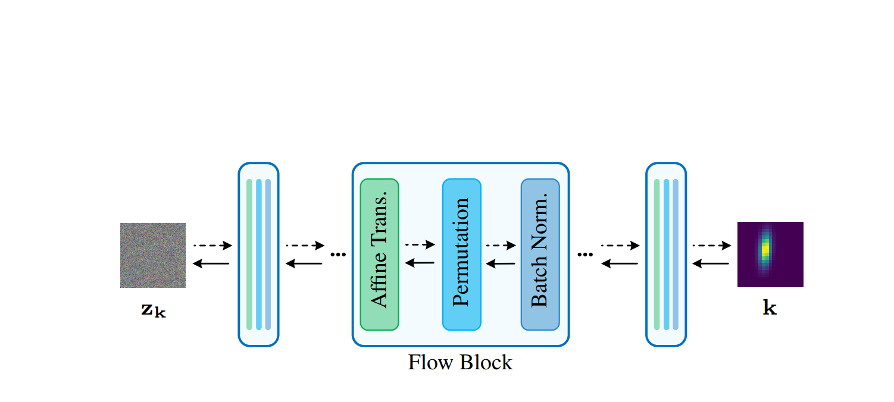
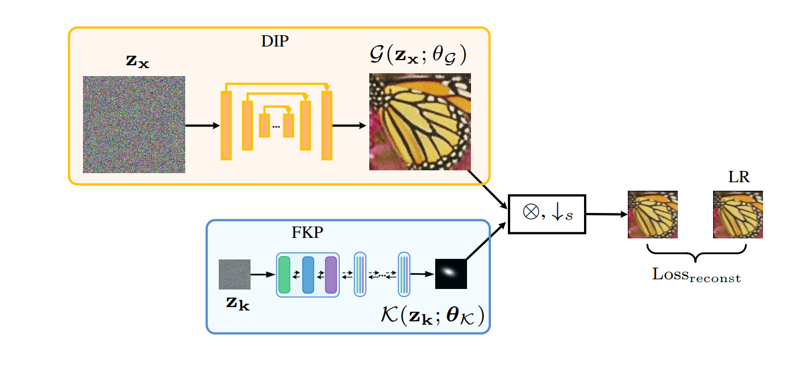
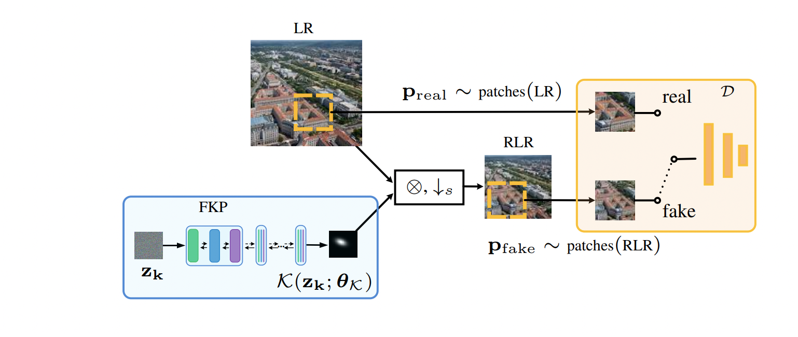

# Flow-based Kernel Prior with Application to Blind Super-Resolution (FKP)

This repository is the official PyTorch implementation of Flow-based Kernel Prior with Application to Blind Super-Resolution [arxiv link](https://arxiv.org/abs/2030.12345).

 :rocket:  :rocket:  :rocket: News: 
 - Dec. 07, 2020: See another work on spatially variant blind SR kernel estimation [here](https://github.com/JingyunLiang/MANet).
 
 ---

> Kernel estimation is the core part of blind image super-resolution (SR). While existing methods capture kernel statistics by either network architecture prior, or deep linear network, there are still gaps toward a powerful kernel prior that models the kernel distribution. In this paper, we propose a flow-based kernel prior (FKP) network for kernel modeling. By employing normalizing flow, it learns an invertible mapping between the complex kernel distribution and a tractable latent distribution, and can be easily integrated into existing blind SR methods such as Double-DIP and KernelGAN. Specifically, instead of starting with random initialization and optimizing slowly, FKP traverses the learned kernel manifold and searches for the best kernel prediction. This is formulated by optimizing the latent variable under the guidance of kernel estimation loss (e.g., LR image reconstruction error). FKP can generate reasonable kernel initialization and enable stable optimization, thus giving accurate kernel estimation. Extensive experiments on synthetic and real-world images demonstrate that FKP improves the kernel estimation performance, and leads to state-of-the-art results in blind SR.
><p align="center">
  > 
</p>

## Requirements
- Python 3.6, PyTorch >= 1.6 
- Requirements: opencv-python, tqdm
- Platforms: Ubuntu 16.04, cuda-10.0 & cuDNN v-7.5

## Data Preparation
To prepare testing data, please organize images as `data/datasets/DIV2K/HR/0801.png`, and run this command:
```bash
cd data
python prepare_dataset.py --model DIPFKP --sf 2 --dataset Set5
python prepare_dataset.py --model KernelGANFKP --sf 2 --dataset DIV2K
```
Commonly used datasets can be downloaded [here](https://github.com/xinntao/BasicSR/blob/master/docs/DatasetPreparation.md#common-image-sr-datasets). Note that KernelGAN/KernelGAN-FKP use analytic X4 kernel based on X2, and do not support X3.

## FKP

To train FKP, run this command:

```bash
cd FKP
python main.py --train --sf 2
```
Pretrained FKP and [USRNet](https://github.com/cszn/KAIR) models are already provided in `data/pretrained_models`.


## DIP-FKP

To test DIP-FKP (no training phase), run this command:

```bash
cd DIPFKP
python main.py --SR --sf 2 --dataset Set5
```


## KernelGAN-FKP

To test KernelGAN-FKP (no training phase), run this command:

```bash
cd KernelGANFKP
python main.py --SR --sf 2 --dataset DIV2K
```

## Results
Please refer to the [paper](https://arxiv.org/abs/2030.12345) for results. Since both DIP-FKP and KernelGAn-FKP are randomly intialized, different runs may get slightly different results. The reported results are averages of 5 runs.


## Citation
    @InProceedings{FKP,
        author = {},
        title = {Flow-based Kernel Prior with Application to Blind Super-Resolution},
        booktitle = {},
        month = {},
        year = {}
    }


## License & Acknowledgement

This project is released under the Apache 2.0 license. The codes are based on [normalizing_flows](https://github.com/kamenbliznashki/normalizing_flows), [DIP](https://github.com/DmitryUlyanov/deep-image-prior), [KernelGAN](https://github.com/sefibk/KernelGAN) and [USRNet](https://github.com/cszn/KAIR). Please also follow their licenses. Thanks for their great works.


